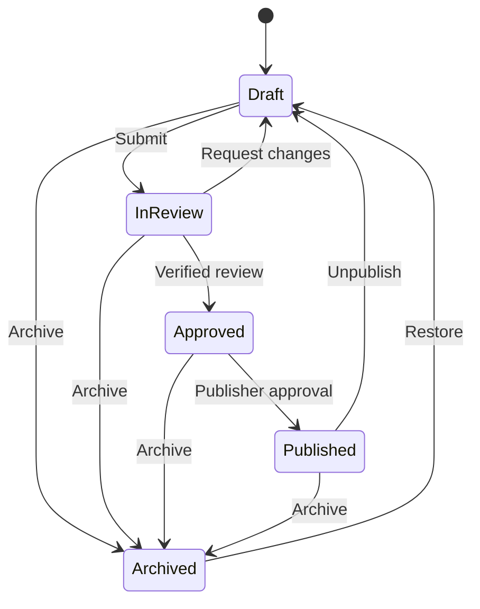

# Knowledge CMS foundation

This foundation adds the server-side data model and workflow boundary for
editable Medicare educational records. It remains disabled by default and is
not connected to a public route, page, sitemap, or the existing Resource
Library registry.

## Safety boundary

- `KNOWLEDGE_CMS_ENABLED` is server-only and accepts only the exact value
  `true`.
- The data-access and workflow modules use `server-only`.
- The private `/admin/knowledge` surface returns 404 while the flag is off.
- Enabling the flag exposes only the noindex admin sign-in route; CMS data
  still requires a verified Firebase session and an explicit CMS role.
- Public pages and components are regression-tested not to import the CMS.
- New records begin as drafts and are blocked from indexing.
- Publishing a record does not make the existing site render it.
- The current static Resource Library remains the production source of truth
  until a separately reviewed migration is complete.

Keep the flag false until the authentication and role-assignment prerequisites
below are complete.

## Firestore collections

| Collection | Purpose |
|---|---|
| `knowledge_articles` | Long-form educational records |
| `knowledge_topics` | Reusable topic and category records |
| `knowledge_faqs` | Reusable question-and-answer records |
| `knowledge_search_documents` | Published-record search projections |
| `knowledge_cms_slugs` | Transactional, per-record-kind slug locks |
| `knowledge_cms_audit_events` | Append-only lifecycle audit events |

The repository writes the canonical record, slug lock, search projection, and
audit event in one Firestore transaction. Updates require the caller's
expected revision, preventing a stale editor from silently overwriting newer
work.

No composite index is required by the current repository implementation.

## Workflow



Articles and FAQs need at least one current source before review. Source review
windows cannot exceed 180 days. An approval requires a distinct reviewer with
an active licensed-agent verification, and its review window cannot exceed 365
days. Verification is checked again at publication.

Published records create a search projection. Draft, review, approved,
archived, and unpublished records remove it. A publisher must explicitly
choose whether a published record is eligible for indexing; eligibility also
requires a canonical path.

## Permission model

| Role | Allowed responsibilities |
|---|---|
| Author | Create records; edit and submit their own drafts |
| Editor | Create, edit, and submit any draft |
| Reviewer | Approve or request changes, but never review their own record |
| Publisher | Publish, unpublish, archive, and restore |
| Admin | Administrative override except self-review |

The model separates authentication from authorization. Firebase custom claims
assign the roles, but the server reads the current Firebase user on every
request instead of trusting claims supplied by a form or browser state.

## Private editorial workspace

`/admin/knowledge` supports:

- Google sign-in through Firebase Auth;
- an eight-hour HTTP-only, SameSite=Strict session cookie;
- list and read views for authenticated CMS users;
- private draft creation for authors, editors, and admins;
- draft editing under the workflow's owner and role rules;
- current-revision checks that stop stale tabs from overwriting newer edits;
- safe DTOs that omit canonical ownership and audit internals from client
  components; and
- articles, topics, FAQs, relationships, source records, search terms, and
  future discoverability metadata.

Session exchange requires a sign-in from the preceding five minutes. Every
read and mutation verifies the Firebase session with revocation checking and
reloads the current user record, so disabled accounts and role removals take
effect without trusting stale browser claims. Session endpoints require an
exact same-origin request.

This release intentionally has no submit, approve, request-changes, publish,
unpublish, archive, restore, public-rendering, or migration controls.

## Authentication rollout prerequisites

Before changing `KNOWLEDGE_CMS_ENABLED` to `true`:

1. Enable Google as a Firebase Authentication provider.
2. Add the production and intended non-production hosts to Firebase Auth's
   authorized domains.
3. Supply `NEXT_PUBLIC_FIREBASE_API_KEY`,
   `NEXT_PUBLIC_FIREBASE_AUTH_DOMAIN`, and
   `NEXT_PUBLIC_FIREBASE_PROJECT_ID` at build time. The deployment workflow
   reads the API key and Auth domain from GitHub repository variables and uses
   `FIREBASE_PROJECT_ID` for the public project ID.
4. Confirm the browser and Admin SDK use the same Firebase project.
5. Assign each approved user a `knowledgeCmsRoles` custom claim containing only
   `author`, `editor`, `reviewer`, `publisher`, or `admin`.
6. Optionally assign `knowledgeCmsAgentSlug` only when it matches a verified
   agent authority record.
7. Verify the Cloud Run service account can access the CMS Firestore
   collections and has `firebaseauth.users.get` plus
   `firebaseauth.users.createSession`. Prefer a custom least-privilege role;
   `roles/firebaseauth.admin` also contains both but grants broader Auth
   administration.
8. Test sign-in, unauthorized access, author ownership, and a revision conflict
   in a non-production environment.

The deployment workflow treats `KNOWLEDGE_CMS_ENABLED` as `false` when the
repository variable is absent. If that variable is set to `true`, deployment
fails before building unless the Firebase browser API key and Auth domain
variables are present.

Example custom-claim shape:

```json
{
  "knowledgeCmsRoles": ["author", "editor"],
  "knowledgeCmsAgentSlug": "verified-agent-slug"
}
```

Role assignment remains an operator-controlled Firebase Admin task. The
browser never receives a way to assign or elevate roles.

## Not included in this release

- Public Knowledge Center rendering
- Migration of the existing static registry
- Hosted search service or embeddings
- Editorial workflow transition controls
- Firebase role-assignment tooling
- Changes to titles, headings, canonicals, redirects, robots rules, or sitemap
  URLs

## Next release gate

The next workflow-interface release may add submit-for-review and
request-changes controls. It must preserve per-action authentication,
ownership, reviewer separation, source currency, verified reviewer identity,
revision checks, and minimal DTOs. Approval and publication should remain a
later independently reviewed release.
