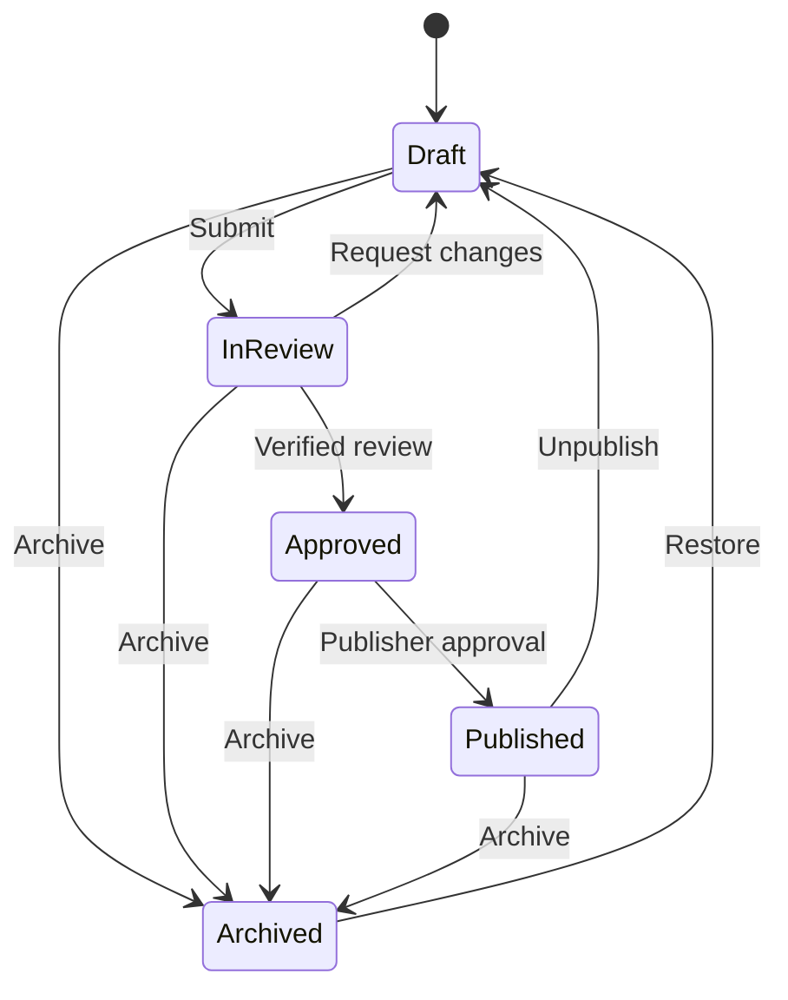

# Knowledge CMS foundation

This foundation adds the server-side data model and workflow boundary for
editable Medicare educational records. It remains disabled by default and is
not connected to a public route, page, sitemap, or the existing Resource
Library registry.

## Safety boundary

- `KNOWLEDGE_CMS_ENABLED` is server-only and accepts only the exact value
  `true`.
- The data-access and workflow modules use `server-only`.
- Enabling the flag does not expose an endpoint or user interface.
- Public pages and components are regression-tested not to import the CMS.
- New records begin as drafts and are blocked from indexing.
- Publishing a record does not make the existing site render it.
- The current static Resource Library remains the production source of truth
  until a separately reviewed migration is complete.

Keep the flag false until authenticated admin routes or actions perform fresh
identity and authorization checks on every request.

## Firestore collections

| Collection | Purpose |
|---|---|
| `knowledge_articles` | Long-form educational records |
| `knowledge_topics` | Reusable topic and category records |
| `knowledge_faqs` | Reusable question-and-answer records |
| `knowledge_search_documents` | Published-record search projections |
| `knowledge_cms_slugs` | Transactional, per-record-kind slug locks |
| `knowledge_cms_audit_events` | Append-only lifecycle audit events |

The repository writes the canonical record, slug lock, search projection, and
audit event in one Firestore transaction. Updates require the caller's
expected revision, preventing a stale editor from silently overwriting newer
work.

No composite index is required by the current repository implementation.

## Workflow

Articles and FAQs need at least one current source before review. Source review
windows cannot exceed 180 days. An approval requires a distinct reviewer with
an active licensed-agent verification, and its review window cannot exceed 365
days. Verification is checked again at publication.

Published records create a search projection. Draft, review, approved,
archived, and unpublished records remove it. A publisher must explicitly
choose whether a published record is eligible for indexing; eligibility also
requires a canonical path.

## Permission model

| Role | Allowed responsibilities |
|---|---|
| Author | Create records; edit and submit their own drafts |
| Editor | Create, edit, and submit any draft |
| Reviewer | Approve or request changes, but never review their own record |
| Publisher | Publish, unpublish, archive, and restore |
| Admin | Administrative override except self-review |

The model separates authentication from authorization. These roles are domain
claims only; the next admin-surface release must derive them from a verified
server-side identity and must not accept role or user identifiers from form
fields, query strings, or client state.

## Not included in this release

- Admin pages, forms, routes, or server actions
- Authentication or session management
- Public Knowledge Center rendering
- Migration of the existing static registry
- Hosted search service or embeddings
- Changes to titles, headings, canonicals, redirects, robots rules, or sitemap
  URLs

## Next release gate

The authenticated admin CRUD release must:

1. verify identity inside every mutation and read boundary;
2. map the identity to server-authoritative CMS roles;
3. return minimal data-transfer objects;
4. validate all client input;
5. preserve revision checks and workflow transitions;
6. remain inaccessible while `KNOWLEDGE_CMS_ENABLED` is false; and
7. add request-level authorization and negative-path tests before the feature
   can be enabled anywhere.
