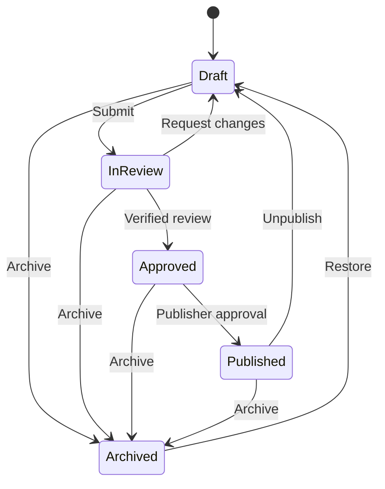

# Knowledge CMS foundation

This foundation adds the server-side data model and workflow boundary for
editable Medicare educational records. It remains disabled by default and is
not connected to a public route, page, sitemap, or the existing Resource
Library registry.

## Safety boundary

- `KNOWLEDGE_CMS_ENABLED` is server-only and accepts only the exact value
  `true`.
- `KNOWLEDGE_CMS_PUBLIC_RENDERER_MODE` is server-only, defaults to `static`,
  and accepts only exact `static` or `shadow`. `shadow` enables the
  authenticated comparison workspace but still resolves every public request
  to the existing static route. `cutover` and malformed values are rejected.
- The data-access and workflow modules use `server-only`.
- The private `/admin/knowledge` surface returns 404 while the flag is off.
- Enabling the flag exposes only the noindex admin sign-in route; CMS data
  still requires a verified Firebase session and an explicit CMS role.
- Public pages and components are regression-tested not to import the CMS.
- New records begin as drafts and are blocked from indexing.
- Publishing a record does not make the existing site render it.
- The current static Resource Library remains the production source of truth
  until a separately reviewed migration is complete.

Keep the flag false until the authentication and role-assignment prerequisites
below are complete.

## Firestore collections

| Collection | Purpose |
|---|---|
| `knowledge_articles` | Long-form educational records |
| `knowledge_topics` | Reusable topic and category records |
| `knowledge_faqs` | Reusable question-and-answer records |
| `knowledge_search_documents` | Published-record search projections |
| `knowledge_cms_slugs` | Transactional, per-record-kind slug locks |
| `knowledge_cms_audit_events` | Append-only lifecycle audit events |

The repository writes the canonical record, slug lock, search projection, and
audit event in one Firestore transaction. Updates require the caller's
expected revision, preventing a stale editor from silently overwriting newer
work.

No composite index is required by the current repository implementation.

## Workflow



Articles and FAQs need at least one current source before review. Source review
windows cannot exceed 180 days. An approval requires a distinct reviewer with
an active licensed-agent verification, and its review window cannot exceed 365
days. Verification is checked again at publication. The authenticated user who
approved the record—and any account carrying the same reviewer agent
identity—cannot publish that record.

Submitting uses the latest saved revision and clears any prior active change
request. Requesting changes requires a current, unambiguous licensed-reviewer
verification plus non-empty feedback. The returned draft exposes only the
feedback and request time to the editor; the canonical reviewer verification
and the same feedback remain in the governed record and append-only audit
event.

Published records create a search projection. Draft, review, approved,
archived, and unpublished records remove it. A publisher must explicitly
choose whether a published record is eligible for indexing; eligibility also
requires a canonical path and an exact confirmation of that approved path.
Publish and unpublish both require an audited decision note. Unpublishing
atomically deletes the search projection, blocks indexing, clears the expired
approval, and returns the record to draft.

## Permission model

| Role | Allowed responsibilities |
|---|---|
| Author | Create records; edit and submit their own drafts |
| Editor | Create, edit, and submit any draft |
| Reviewer | Approve or request changes, but never review their own record |
| Publisher | Publish, unpublish, archive, and restore |
| Admin | Administrative override except self-review and reviewer/publisher separation |

The model separates authentication from authorization. Firebase custom claims
assign the roles, but the server reads the current Firebase user on every
request instead of trusting claims supplied by a form or browser state.

## Private editorial workspace

`/admin/knowledge` supports:

- Google sign-in through Firebase Auth;
- an eight-hour HTTP-only, SameSite=Strict session cookie;
- list and read views for authenticated CMS users;
- private draft creation for authors, editors, and admins;
- draft editing under the workflow's owner and role rules;
- current-revision checks that stop stale tabs from overwriting newer edits;
- submit-for-review controls for authorized draft owners and editors;
- request-changes controls for verified reviewers who are not the record
  owner, with required feedback visible on the returned draft;
- verified approval controls for reviewers who are not the record owner, with
  a required private decision note and a server-calculated review deadline
  bounded by source, reviewer-verification, and policy dates;
- publisher-only publish controls with a required audit note, a deliberate
  blocked-or-eligible indexing decision, exact canonical confirmation for
  eligibility, and reviewer/publisher separation;
- publisher-only unpublish controls that require a reason and atomically
  remove the search projection before returning the record to draft;
- safe DTOs that omit canonical ownership and audit internals from client
  components;
- articles, topics, FAQs, relationships, source records, search terms, and
  future discoverability metadata; and
- a publisher/admin-only Resource Library migration preview that reads all
  three CMS collections, maps the static registry into deterministic target
  IDs, and reports source, slug, canonical, relationship, and existing-record
  conflicts without creating or changing a record; and
- a deterministic route-parity manifest for all 22 article targets that pins
  the exported page metadata, canonical and Open Graph values, H1, rendered
  byte count, page-specific structured-data types, form/FAQ counts, and the
  SHA-256 of each server-rendered route body; and
- a versioned lossless-renderer contract for every article route that maps
  required React capabilities to adapters and parity evidence, plus a
  route-specific verified-static rollback; and
- a publisher/admin-only `/admin/knowledge/shadow-preview` workspace that is
  available only in exact `shadow` mode, reads the article collection once,
  renders successful candidates through inert code-backed adapters, compares
  them with the 22 immutable contracts, and always reports a write count of
  zero.

Session exchange requires a sign-in from the preceding five minutes. Every
read and mutation verifies the Firebase session with revocation checking and
reloads the current user record, so disabled accounts and role removals take
effect without trusting stale browser claims. Session endpoints require an
exact same-origin request.

The migration preview is intentionally not an import control. It has no Server
Action, repository `save`, workflow transition, upload, or execute path. Its
output always reports a write count of zero and keeps every proposed target
indexing-blocked. Article route bodies and metadata now have explicit,
test-enforced parity snapshots. Article migration still fails closed because
the CMS Markdown body is not used for public rendering and no reviewed
route-level shadow evidence exists yet. The private shadow adapter preserves
the current React component tree, forms, FAQ disclosures, relationship cards,
structured data, and dynamic registries for comparison only. It cannot
authorize public cutover.

This release intentionally has no archive, restore, public rendering, or
migration execution. CMS publication remains private: it writes the governed
record and search projection but does not add a route, sitemap entry, public
card, schema block, or visible content to the existing site.

## Authentication rollout prerequisites

Before changing `KNOWLEDGE_CMS_ENABLED` to `true`:

1. Enable Google as a Firebase Authentication provider.
2. Add the production and intended non-production hosts to Firebase Auth's
   authorized domains.
3. Supply `NEXT_PUBLIC_FIREBASE_API_KEY`,
   `NEXT_PUBLIC_FIREBASE_AUTH_DOMAIN`, and
   `NEXT_PUBLIC_FIREBASE_PROJECT_ID` at build time. The deployment workflow
   reads the API key and Auth domain from GitHub repository variables and uses
   `FIREBASE_PROJECT_ID` for the public project ID.
4. Confirm the browser and Admin SDK use the same Firebase project.
5. Assign each approved user a `knowledgeCmsRoles` custom claim containing only
   `author`, `editor`, `reviewer`, `publisher`, or `admin`.
6. Optionally assign `knowledgeCmsAgentSlug` only when it matches a verified
   agent authority record.
7. Verify the Cloud Run service account can access the CMS Firestore
   collections and has `firebaseauth.users.get` plus
   `firebaseauth.users.createSession`. Prefer a custom least-privilege role;
   `roles/firebaseauth.admin` also contains both but grants broader Auth
   administration.
8. Test sign-in, unauthorized access, author ownership, and a revision conflict
   in a non-production environment.

The deployment workflow treats `KNOWLEDGE_CMS_ENABLED` as `false` when the
repository variable is absent. If that variable is set to `true`, deployment
fails before building unless the Firebase browser API key and Auth domain
variables are present.

The workflow treats `KNOWLEDGE_CMS_PUBLIC_RENDERER_MODE` as `static` when the
repository variable is absent. Exact `shadow` is deployable only as a private
comparison mode and requires the CMS authentication boundary to be useful.
`cutover`, whitespace-padded, differently cased, and other malformed values
fail before image build. The existing static routes remain the only public
source in both accepted modes.

Example custom-claim shape:

```json
{
  "knowledgeCmsRoles": ["author", "editor"],
  "knowledgeCmsAgentSlug": "verified-agent-slug"
}
```

Role assignment remains an operator-controlled Firebase Admin task. The
browser never receives a way to assign or elevate roles.

## Not included in this release

- Public Knowledge Center rendering
- Migration execution for the existing static registry
- CMS conversion or import of public route bodies
- Hosted search service or embeddings
- Static-registry migration or import controls
- Firebase role-assignment tooling
- Changes to titles, headings, canonicals, redirects, robots rules, or sitemap
  URLs

## Migration preview contract

`/admin/knowledge/migration-preview` is available only when the CMS flag is
enabled and the current verified Firebase user has a `publisher` or `admin`
role. It:

- maps 22 Resource Library entries to article targets;
- maps six library categories and six Medicare topics to topic targets;
- maps the 11 governed FAQs and their factual-source lineage;
- preserves current canonical paths, curated relationships, entities, source
  check dates, and source review deadlines;
- compares proposed IDs, per-kind slugs, canonical paths, governed content,
  and relationships with existing CMS records;
- recognizes equivalent topic and FAQ records without proposing an overwrite;
- verifies all 22 article route bodies and metadata against deterministic
  snapshots; and
- identifies private-shadow adapters for all 22 article routes while keeping
  every article migration and public cutover blocked.

The preview does not claim the migration is executable. `readyToExecute` is
always false, `writeCount` is always zero, and the page contains no mutation
control. The parity manifest deliberately excludes the homepage and
`/medicare-spokane`.

## Lossless renderer and rollback contract

Every one of the 22 article routes has a contract that:

- binds the future CMS article to its current path, canonical URL, static
  source module, body SHA-256, and route-parity manifest version;
- requires typed adapters for the existing React component tree, related
  content, structured data, lead forms, FAQ disclosures, and any governed FAQ
  or carrier registry used by that route;
- requires an exact candidate match for title, description, canonical and Open
  Graph values, H1, schema types, form count, FAQ count, rendered byte count,
  and rendered SHA-256;
- allows only private shadow comparison through a code-backed adapter after a
  matching governed published CMS record exists, while keeping public cutover
  ineligible because the CMS Markdown body is not the public body source; and
- defines a no-write rollback to the current static route while preserving CMS
  records for diagnosis or correction.

`KNOWLEDGE_CMS_PUBLIC_RENDERER_MODE` has three reserved states:

| Mode | Contract meaning in this release | Public source |
|---|---|---|
| `static` | Default; private shadow workspace is hidden | Existing static route |
| `shadow` | Enables authenticated publisher/admin comparison only | Existing static route |
| `cutover` | Rejected; no public CMS body renderer is approved | Existing static route |

Invalid, whitespace-padded, differently cased, and `cutover` values cannot
activate the renderer. Exact `shadow` sets `privateShadowEnabled=true` while
the resolver's effective public mode remains `static`.

The shadow workspace:

- requires exact `KNOWLEDGE_CMS_ENABLED=true` and renderer mode `shadow`;
- requires a current verified Firebase session with `publisher` or `admin`;
- reads only `knowledge_articles` and performs no save, transition, create,
  audit, search-projection, or migration write;
- requires the matching record to be published, current, reviewed, sourced,
  canonical-path matched, and metadata matched before comparison;
- renders successful candidates through the exact existing React page module
  in an inert admin-only container;
- exposes only minimal comparison evidence, not CMS ownership or audit
  internals; and
- always leaves CMS Markdown non-public and `cutoverEligible=false`.

Rollback triggers are candidate unavailability, render error, parity,
metadata, canonical, capability, or protected-route mismatch. The contract
requires the verified static source and snapshot for every route, sets the
global mode back to `static`, performs no CMS data mutation, and keeps `/` and
`/medicare-spokane` outside the renderer inventory.

## Next release gate

The next independently reviewed release may define the deterministic private
article control-record representation needed to create draft migration
records without claiming that Markdown is the public page body. It must remain
non-mutating, preserve static public output, and keep execution and cutover
separate. No cutover should be proposed until governed records exist and
route-by-route shadow evidence plus rollback verification are reviewed.
