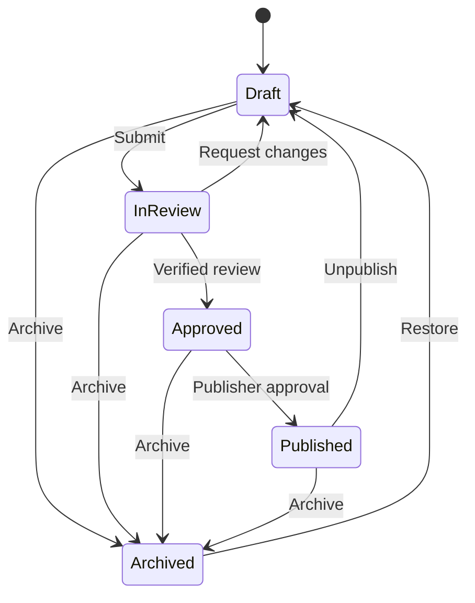

# Knowledge CMS foundation

This foundation adds the server-side data model and workflow boundary for
editable Medicare educational records. It remains disabled by default and is
not connected to a public route, page, sitemap, or the existing Resource
Library registry.

## Safety boundary

- `KNOWLEDGE_CMS_ENABLED` is server-only and accepts only the exact value
  `true`.
- `KNOWLEDGE_CMS_PUBLIC_RENDERER_MODE` is server-only, defaults to `static`,
  and accepts only exact `static` or `shadow`. `shadow` enables the
  authenticated comparison workspace but still resolves every public request
  to the existing static route. `cutover` and malformed values are rejected.
- The data-access and workflow modules use `server-only`.
- The private `/admin/knowledge` surface returns 404 while the flag is off.
- Enabling the flag exposes only the noindex admin sign-in route; CMS data
  still requires a verified Firebase session and an explicit CMS role.
- Public pages and components are regression-tested not to import the CMS.
- New records begin as drafts and are blocked from indexing.
- Publishing a record does not make the existing site render it.
- The current static Resource Library remains the production source of truth
  until a separately reviewed migration is complete.

Keep the flag false until the authentication and role-assignment prerequisites
below are complete.

## Firestore collections

| Collection | Purpose |
|---|---|
| `knowledge_articles` | Long-form educational records |
| `knowledge_topics` | Reusable topic and category records |
| `knowledge_faqs` | Reusable question-and-answer records |
| `knowledge_search_documents` | Published-record search projections |
| `knowledge_cms_slugs` | Transactional, per-record-kind slug locks |
| `knowledge_cms_canonical_paths` | Transactional, cross-kind canonical-path locks |
| `knowledge_cms_audit_events` | Append-only lifecycle audit events |

The repository writes the canonical record, slug lock, canonical-path lock,
search projection, and audit event in one Firestore transaction. Updates
require the caller's expected revision, preventing a stale editor from
silently overwriting newer work.

No composite index is required by the current repository implementation.

## Workflow



Articles and FAQs need at least one current source before review. Source review
windows cannot exceed 180 days. An approval requires a distinct reviewer with
an active licensed-agent verification, and its review window cannot exceed 365
days. Verification is checked again at publication. The authenticated user who
approved the record—and any account carrying the same reviewer agent
identity—cannot publish that record.

Submitting uses the latest saved revision and clears any prior active change
request. Requesting changes requires a current, unambiguous licensed-reviewer
verification plus non-empty feedback. The returned draft exposes only the
feedback and request time to the editor; the canonical reviewer verification
and the same feedback remain in the governed record and append-only audit
event.

Published records create a search projection. Draft, review, approved,
archived, and unpublished records remove it. A publisher must explicitly
choose whether a published record is eligible for indexing; eligibility also
requires a canonical path and an exact confirmation of that approved path.
Publish and unpublish both require an audited decision note. Unpublishing
atomically deletes the search projection, blocks indexing, clears the expired
approval, and returns the record to draft.

## Permission model

| Role | Allowed responsibilities |
|---|---|
| Author | Create records; edit and submit their own drafts |
| Editor | Create, edit, and submit any draft |
| Reviewer | Approve or request changes, but never review their own record |
| Publisher | Publish, unpublish, archive, and restore |
| Admin | Administrative override except self-review and reviewer/publisher separation |

The model separates authentication from authorization. Firebase custom claims
assign the roles, but the server reads the current Firebase user on every
request instead of trusting claims supplied by a form or browser state.

## Private editorial workspace

`/admin/knowledge` supports:

- Google sign-in through Firebase Auth;
- an eight-hour HTTP-only, SameSite=Strict session cookie;
- list and read views for authenticated CMS users;
- private draft creation for authors, editors, and admins;
- draft editing under the workflow's owner and role rules;
- current-revision checks that stop stale tabs from overwriting newer edits;
- submit-for-review controls for authorized draft owners and editors;
- request-changes controls for verified reviewers who are not the record
  owner, with required feedback visible on the returned draft;
- verified approval controls for reviewers who are not the record owner, with
  a required private decision note and a server-calculated review deadline
  bounded by source, reviewer-verification, and policy dates;
- publisher-only publish controls with a required audit note, a deliberate
  blocked-or-eligible indexing decision, exact canonical confirmation for
  eligibility, and reviewer/publisher separation;
- publisher-only unpublish controls that require a reason and atomically
  remove the search projection before returning the record to draft;
- safe DTOs that omit canonical ownership and audit internals from client
  components;
- articles, topics, FAQs, relationships, source records, search terms, and
  future discoverability metadata; and
- a publisher/admin-only Resource Library migration preview that reads all
  three CMS collections, maps the static registry into deterministic target
  IDs, and reports source, slug, canonical, relationship, and existing-record
  conflicts without creating or changing a record; and
- a deterministic route-parity manifest for all 22 article targets that pins
  the exported page metadata, canonical and Open Graph values, H1, rendered
  byte count, page-specific structured-data types, form/FAQ counts, and the
  SHA-256 of each server-rendered route body; and
- an immutable, deterministic private-draft control record for every article
  target, including fail-if-present semantics, server-owned actor/audit field
  requirements, a canonical SHA-256 fingerprint, and an explicit zero-write
  execution block; and
- a versioned lossless-renderer contract for every article route that maps
  required React capabilities to adapters and parity evidence, plus a
  route-specific verified-static rollback; and
- a publisher/admin-only `/admin/knowledge/shadow-preview` workspace that is
  available only in exact `shadow` mode, reads the article collection once,
  renders successful candidates through inert code-backed adapters, compares
  them with the 22 immutable contracts, and always reports a write count of
  zero.

Session exchange requires a sign-in from the preceding five minutes. Every
read and mutation verifies the Firebase session with revocation checking and
reloads the current user record, so disabled accounts and role removals take
effect without trusting stale browser claims. Session endpoints require an
exact same-origin request.

The migration preview and its dry-run receipts remain non-mutating and always
report a write count of zero. Displayed article controls are immutable
representations rather than stored Firestore documents. A separate exact-true
gate exposes the one-record execution form described below; a dry-run receipt
is evidence only and is never accepted as write authority. Article route bodies
and metadata retain explicit, test-enforced parity snapshots. Public article
cutover still fails closed because the CMS Markdown body is not used for public
rendering and no reviewed route-level cutover evidence exists. The private
shadow adapter preserves the current React component tree, forms, FAQ
disclosures, relationship cards, structured data, and dynamic registries for
comparison only. It cannot authorize public cutover.

This release intentionally has no archive, restore, public rendering, bulk
migration, overwrite, or indexing path. The only migration mutation is the
separately gated, explicitly confirmed creation of one private article draft
plus its transactional locks and audit event. CMS publication remains private:
it writes the governed record and search projection but does not add a route,
sitemap entry, public card, schema block, or visible content to the existing
site.

## Authentication rollout prerequisites

Before changing `KNOWLEDGE_CMS_ENABLED` to `true`:

1. Enable Google as a Firebase Authentication provider.
2. Add the production and intended non-production hosts to Firebase Auth's
   authorized domains.
3. Supply `NEXT_PUBLIC_FIREBASE_API_KEY`,
   `NEXT_PUBLIC_FIREBASE_AUTH_DOMAIN`, and
   `NEXT_PUBLIC_FIREBASE_PROJECT_ID` at build time. The deployment workflow
   reads the API key and Auth domain from GitHub repository variables and uses
   `FIREBASE_PROJECT_ID` for the public project ID.
4. Confirm the browser and Admin SDK use the same Firebase project.
5. Assign each approved user a `knowledgeCmsRoles` custom claim containing only
   `author`, `editor`, `reviewer`, `publisher`, or `admin`.
6. Optionally assign `knowledgeCmsAgentSlug` only when it matches a verified
   agent authority record.
7. Verify the Cloud Run service account can access the CMS Firestore
   collections and has `firebaseauth.users.get` plus
   `firebaseauth.users.createSession`. The Auth `users.get` permission covers
   the aggregate, identity-suppressed user listing used by readiness. Prefer a
   custom least-privilege role; `roles/firebaseauth.admin` also contains both
   but grants broader Auth administration.
8. Test sign-in, unauthorized access, author ownership, and a revision conflict
   in a non-production environment.

The deployment workflow treats `KNOWLEDGE_CMS_ENABLED` as `false` when the
repository variable is absent. If that variable is set to `true`, deployment
fails before building unless the Firebase browser API key and Auth domain
variables are present.

The workflow treats `KNOWLEDGE_CMS_PUBLIC_RENDERER_MODE` as `static` when the
repository variable is absent. Exact `shadow` is deployable only as a private
comparison mode and requires the CMS authentication boundary to be useful.
`cutover`, whitespace-padded, differently cased, and other malformed values
fail before image build. The existing static routes remain the only public
source in both accepted modes.

Example custom-claim shape:

```json
{
  "knowledgeCmsRoles": ["author", "editor"],
  "knowledgeCmsAgentSlug": "verified-agent-slug"
}
```

Role assignment remains an operator-controlled Firebase Admin task. The
browser never receives a way to assign or elevate roles.

## Not included in this release

- Public Knowledge Center rendering
- CMS conversion or import of public route bodies
- Hosted search service or embeddings
- Bulk, overwrite, update, publish, or indexing migration executors
- Firebase role-assignment tooling
- Changes to titles, headings, canonicals, redirects, robots rules, or sitemap
  URLs

## Migration preview contract

`/admin/knowledge/migration-preview` is available only when the CMS flag is
enabled and the current verified Firebase user has a `publisher` or `admin`
role. It:

- maps 22 Resource Library entries to article targets;
- maps six library categories and six Medicare topics to topic targets;
- maps the 11 governed FAQs and their factual-source lineage;
- preserves current canonical paths, curated relationships, entities, source
  check dates, and source review deadlines;
- compares proposed IDs, per-kind slugs, canonical paths, governed content,
  and relationships with existing CMS records;
- recognizes equivalent topic and FAQ records without proposing an overwrite;
- verifies all 22 article route bodies and metadata against deterministic
  snapshots;
- defines and fingerprints all 22 create-private-draft article controls while
  leaving their execution disabled;
- compiles those controls into authenticated, server-clocked, zero-write
  materialization receipts against the current Firestore inventory; and
- identifies private-shadow adapters for all 22 article routes while keeping
  every article migration and public cutover blocked.

The preview does not claim the migration is executable. `readyToExecute` is
always false, `writeCount` is always zero, and the page contains no mutation
control. The parity manifest deliberately excludes the homepage and
`/medicare-spokane`.

## Article migration control-record contract

Each of the 22 article targets has a versioned control record that:

- uses the deterministic `resource-entry--*` document ID and canonical slug;
- carries the exact title, summary, metadata, sources, relationships, and
  indexing-blocked discoverability needed for a future private draft;
- contains a private Markdown control note that names the verified static
  route and rendered SHA-256 and explicitly states that it is not the public
  page body;
- excludes `ownerId`, audit timestamps, review, and publication fields so a
  future server boundary must resolve the authenticated actor and server
  clock;
- requires `expectedRevision=null` and fails if the target record already
  exists rather than overwriting it;
- is canonically serialized with recursively sorted object keys and pinned by
  a SHA-256 fingerprint; and
- reports `status=disabled`, `readyToExecute=false`, `writeCount=0`,
  `indexing=blocked`, `cmsBodyPubliclyRendered=false`, and
  `cutoverEligible=false`.

The control record is a reviewable creation contract only. No browser request
can submit its payload, no repository method accepts a client-supplied control,
and no control record is stored. The separately gated execution boundary
accepts only its ID and fingerprint, then reconstructs and revalidates the
complete control on the server inside the transaction.

## Article materialization dry-run contract

The authenticated migration preview also performs a non-mutating dry run for
the 22 article controls. On each request it:

- resolves the current Firebase actor again on the server and permits only a
  `publisher` or `admin`;
- uses one server-clock timestamp for the owner and revision-one audit fields;
- reads the same complete article, topic, and FAQ inventory used by the
  migration preview and confirms whether every create-only article target is
  currently absent;
- blocks a target when its document already exists or a current record owns
  its slug or canonical path;
- revalidates the deterministic control fingerprint and compiles a
  schema-valid, indexing-blocked private draft in memory only when those
  preconditions pass; and
- fingerprints each receipt and the complete batch so the control, observed
  state, actor, timestamp, and in-memory result are bound together.

The observation is not a lock and every receipt requires a transactional
recheck. `readyToExecute` remains false, execution eligibility and write count
remain zero, and the receipt itself is never submitted to a Server Action or
repository. Reloading the page performs a fresh read and creates new
timestamped receipts; it does not store them. The separate execution form uses
only the immutable control ID/fingerprint and performs an independent
transactional validation.

## Single-article private-draft execution contract

`KNOWLEDGE_CMS_ARTICLE_MIGRATION_EXECUTION_ENABLED` is a separate server-only,
exact-`true` gate and cannot be enabled by the deployment workflow unless
`KNOWLEDGE_CMS_ENABLED=true`. When both gates are enabled, a publisher or admin
may create one Resource Library article draft from the private migration page
only after typing the exact control-specific confirmation phrase.

The Server Action accepts only the selected control ID, its SHA-256, and the
typed phrase. The mutation DAL reloads the current authenticated actor, and
the Firestore transaction reconstructs the control from the immutable static
registry, revalidates its fingerprint, supplies one transaction server-clock
timestamp, and fails closed unless all of the following remain absent or
available:

- the expected-absent article document;
- the per-kind slug lock and any legacy same-slug article;
- the cross-kind canonical-path lock and any legacy canonical owner;
- the target's private search projection; and
- the revision-one append-only audit event.

One successful execution creates four Firestore documents atomically: the
private article draft, slug lock, canonical-path lock, and revision-one audit
event. The draft stays indexing-blocked, has no review or publication state,
and contains only the private migration control note. The writer has no update,
overwrite, bulk, public-render, sitemap, indexing, or cutover behavior. The
existing verified React route remains the public source.

The revision-one audit event also stores the execution version, expected write
count, canonical path, and SHA-256 of the exact server-materialized record.
Executions created by the immediately preceding release remain readable as
legacy events; they are verified directly against their current artifacts and
are never silently upgraded or rewritten.

## Execution history and post-create verification contract

The publisher/admin migration workspace reads authenticated execution history
from `migration_create_private_draft` audit events only. It validates the
document ID, actor, record identity, timestamp, control ID/fingerprint, static
public-source marker, and optional current-version evidence before exposing a
row. Malformed audit documents are counted but excluded from actionable
history. History is sorted newest first, limited to 100 valid events, and uses
one audit-collection read with zero writes.

Each valid row opens a private per-record verification route. The route
re-resolves the Firebase actor and again requires `publisher` or `admin`, then
uses a read-only Firestore transaction to obtain one consistent snapshot of
exactly five artifacts:

- the append-only revision-one migration audit event;
- the current article record;
- the current per-kind slug lock;
- the current cross-kind canonical-path lock; and
- the current search projection or its confirmed absence.

For an untouched revision-one draft, the verifier rematerializes the record
from the deterministic control, actor, and execution timestamp and requires an
exact SHA-256 match. For a legitimately edited later revision, it reports
`record_advanced` only when the original creation provenance and all current
locks/search state remain internally consistent. Missing, malformed, stale, or
contradictory evidence reports `failed`; verification never repairs, retries,
publishes, indexes, or changes a record. The receipt itself is timestamped and
fingerprinted but not stored. A successful create redirects to this fresh
verification view instead of treating the transaction response as sufficient
proof.

## Operational readiness report contract

`/admin/knowledge/readiness` is available only when the CMS gate is exact true,
the Firebase session is current, and the server-refreshed actor has `publisher`
or `admin`. Authorization is checked before any report read. The route is
covered by the private admin noindex/noarchive/no-store headers and never enters
the public sitemap.

The report evaluates separate capabilities rather than collapsing unlike
risks into one ambiguous status:

- private workspace configuration and Firebase browser/Admin project alignment;
- aggregate authoring, currently verified reviewer, publisher, and
  reviewer-publisher separation coverage;
- one-record article migration readiness or verified completion;
- private shadow availability while the effective public renderer stays
  `static`; and
- the unconditional prohibition on public cutover.

The Auth scan paginates up to 1,000 accounts per read and returns counts only.
It does not expose UIDs, email addresses, claims, or account records. Malformed
claims, incomplete pagination, duplicate users, missing list permission, no
current licensed reviewer, or no distinct publisher fail closed. Disabled or
unverified accounts with CMS claims are reported but cannot count as active
coverage.

The Firestore portion reuses the three-collection migration inventory and
one-query execution history. Each valid execution event then receives its
existing five-artifact read-only verification transaction. A target is
classified as `prepared_absent` only when its current deterministic control,
fingerprint, in-memory private draft, source/route evidence, and absence checks
pass with no execution event. A present target is ready only when exactly one
valid execution event and one current passing artifact receipt agree. Invalid
or truncated history, stale sources, duplicate events, an unexpected target,
missing locks, a search projection for a private draft, or any failed receipt
blocks readiness.

Every report is immutable and SHA-256 fingerprinted in memory. It records its
successful read boundary and always reports zero writes and no repair. The
receipt is operational evidence only: it cannot assign roles, change a flag,
authorize a migration request, publish a record, enable indexing, or approve a
public renderer.

## Beta activation preview and rollback contract

`/admin/knowledge/beta-activation` is a publisher/admin-only, read-only planning
surface. It is covered by the same authentication, noindex/noarchive, and
private no-store boundary as the rest of the admin workspace. The preview
performs no additional repository read beyond obtaining a fresh operational
readiness report and performs no write, repair, role assignment, deployment,
traffic shift, environment-variable change, or CMS action.

The preview is eligible only when all of the following are true:

- `NEXT_PUBLIC_SITE_ENV` is exact `staging`;
- `NEXT_PUBLIC_SITE_URL` resolves to the clean canonical origin
  `https://beta.medicareinspokane.com` with no credentials, path, query, or
  fragment;
- the operational-readiness receipt is valid, no more than five minutes old,
  not future-dated, and ready for guarded private operations;
- all 22 article targets have prepared or verified one-record evidence with no
  blocked target;
- the current renderer request is exact `static` or `shadow`; and
- the proposed exact `shadow` value continues to resolve to an effective public
  mode of `static`, with CMS bodies, indexing, sitemap output, and cutover
  unchanged.

Production, unknown hosts, malformed or whitespace-padded environment values,
invalid or stale receipts, `cutover`, and contradictory migration evidence fail
closed. Raw malformed URLs are classified rather than reflected, so accidental
credentials or query values do not enter the preview receipt or UI.

The immutable preview binds the current readiness SHA-256 and shows—but never
applies—the three beta-only settings:

| Variable | Proposed private-beta value | Effect |
|---|---|---|
| `KNOWLEDGE_CMS_ENABLED` | `true` | Keep the authenticated private workspace available |
| `KNOWLEDGE_CMS_ARTICLE_MIGRATION_EXECUTION_ENABLED` | `true` until all article targets are verified; otherwise `false` | Preserve only the explicit one-record migration boundary |
| `KNOWLEDGE_CMS_PUBLIC_RENDERER_MODE` | `shadow` | Enable private comparison while public output remains static |

The activation checklist requires new readiness/preview receipts immediately
before a separately approved beta configuration change, one isolated beta
revision, private authorization checks, and complete static-route parity. The
preview explicitly carries no execution, deployment, production, or cutover
authority.

Rollback triggers include evidence drift, authorization failure, any private
shadow mismatch, a migration-boundary violation, protected-route drift, or an
SEO/indexing change. The ordered rollback is:

1. set the beta article-execution gate to `false`;
2. set the beta renderer mode to `static` while preserving CMS records;
3. deploy only the beta rollback configuration and verify static parity;
4. set the beta CMS gate to `false` if the broader private workspace remains
   unsafe; and
5. route only beta traffic to its last known-good beta revision if configuration
   rollback is insufficient.

Rollback never deletes CMS records, locks, audit history, or evidence. It must
reverify all 22 governed routes, `/`, `/medicare-spokane`, `/resources`,
redirects, sitemap output, and the beta robots policy.

## Lossless renderer and rollback contract

Every one of the 22 article routes has a contract that:

- binds the future CMS article to its current path, canonical URL, static
  source module, body SHA-256, and route-parity manifest version;
- requires typed adapters for the existing React component tree, related
  content, structured data, lead forms, FAQ disclosures, and any governed FAQ
  or carrier registry used by that route;
- requires an exact candidate match for title, description, canonical and Open
  Graph values, H1, schema types, form count, FAQ count, rendered byte count,
  and rendered SHA-256;
- allows only private shadow comparison through a code-backed adapter after a
  matching governed published CMS record exists, while keeping public cutover
  ineligible because the CMS Markdown body is not the public body source; and
- defines a no-write rollback to the current static route while preserving CMS
  records for diagnosis or correction.

`KNOWLEDGE_CMS_PUBLIC_RENDERER_MODE` has three reserved states:

| Mode | Contract meaning in this release | Public source |
|---|---|---|
| `static` | Default; private shadow workspace is hidden | Existing static route |
| `shadow` | Enables authenticated publisher/admin comparison only | Existing static route |
| `cutover` | Rejected; no public CMS body renderer is approved | Existing static route |

Invalid, whitespace-padded, differently cased, and `cutover` values cannot
activate the renderer. Exact `shadow` sets `privateShadowEnabled=true` while
the resolver's effective public mode remains `static`.

The shadow workspace:

- requires exact `KNOWLEDGE_CMS_ENABLED=true` and renderer mode `shadow`;
- requires a current verified Firebase session with `publisher` or `admin`;
- reads only `knowledge_articles` and performs no save, transition, create,
  audit, search-projection, or migration write;
- requires the matching record to be published, current, reviewed, sourced,
  canonical-path matched, and metadata matched before comparison;
- renders successful candidates through the exact existing React page module
  in an inert admin-only container;
- exposes only minimal comparison evidence, not CMS ownership or audit
  internals; and
- always leaves CMS Markdown non-public and `cutoverEligible=false`.

Rollback triggers are candidate unavailability, render error, parity,
metadata, canonical, capability, or protected-route mismatch. The contract
requires the verified static source and snapshot for every route, sets the
global mode back to `static`, performs no CMS data mutation, and keeps `/` and
`/medicare-spokane` outside the renderer inventory.

## Next release gate

The next independently reviewed release may define deterministic private-draft
migration controls and verification for the 12 topics and 11 FAQs. It must keep
topic/FAQ execution separate from the article boundary, remain one-record and
create-only, preserve all public routes, and add no bulk action, publication,
indexing, renderer cutover, or production activation. No cutover should be
proposed until all 45 governed records exist and route-by-route shadow evidence
plus rollback verification are reviewed.
